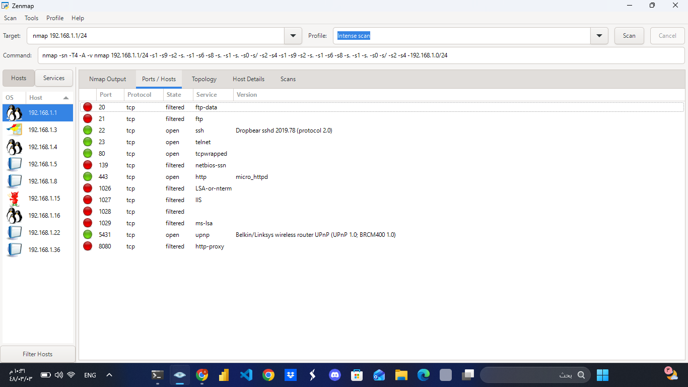
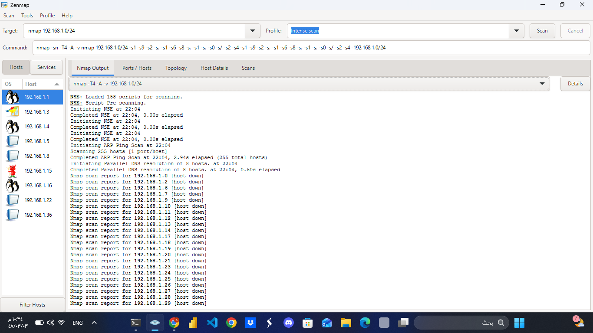
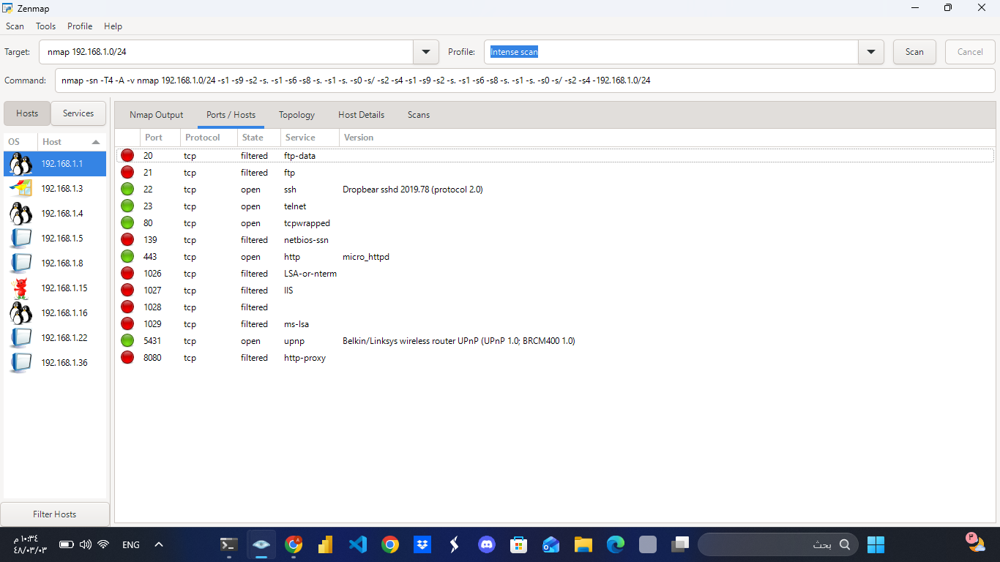

# Network Discovery and Port Scanning with Nmap

## Project Overview

A practical cybersecurity project focused on network discovery, host identification, port scanning, service detection, and basic operating system identification using Nmap and Zenmap.

The project was performed in a controlled local network environment for educational and cybersecurity learning purposes.

## Objectives

- Discover active devices on a local network.
- Identify open, filtered, and closed ports.
- Detect running network services.
- Identify service versions where available.
- Perform basic operating system detection.
- Visualize discovered hosts using Zenmap.

## Tools Used

- Nmap
- Zenmap
- Windows

## Network Range

The scan was performed against the following private network:

192.168.1.0/24

## Scanning Activities

### 1. Network Discovery

Nmap was used to identify active hosts within the local network.

### 2. Port Scanning

The discovered hosts were scanned to identify open, filtered, and closed ports.

### 3. Service Detection

Nmap was used to identify services running on detected ports, including services such as SSH, Telnet, HTTP, and UPnP.

### 4. Operating System Detection

Nmap was used to perform basic operating system detection based on network responses.

### 5. Network Topology

Zenmap was used to visualize the discovered hosts and network topology.

## Results

The scan provided information about:

- Active hosts
- Open ports
- Filtered ports
- Network services
- Service versions
- Operating system information
- Network topology

## Security Observations

The results demonstrate the importance of reviewing exposed network services.

Security recommendations include:

- Disable unnecessary services.
- Avoid insecure protocols such as Telnet when secure alternatives are available.
- Restrict access to administrative services such as SSH.
- Review exposed ports and firewall rules.
- Keep network services updated.

## Screenshots

### Nmap Scan Output

### Ports and Services

### Network Topology

### Host Details

### Scan Results

### Operating System Detection

## Skills Demonstrated

- Network Reconnaissance
- Network Discovery
- Port Scanning
- Service Enumeration
- Basic OS Detection
- Nmap
- Zenmap
- Networking Fundamentals
- Security Assessment
- Technical Documentation

## Ethical Use

This project is intended for educational and authorized security testing only.

Nmap scans should only be performed against systems and networks that you own or have explicit permission to test.

## Future Improvements

- Export scan results automatically to XML or HTML reports.
- Develop a Python script to summarize Nmap results.
- Categorize discovered services by risk level.
- Add vulnerability assessment in a controlled lab environment.
